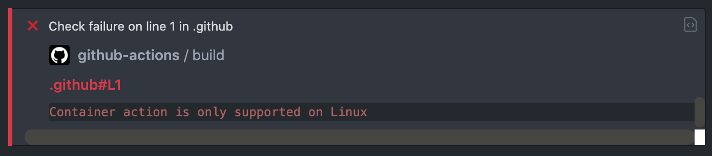

<div align="center">
    <h1>AWS S3 Javascript action</h1>
</div>

<p>This action using the [AWS-SDK for JavaScript in Node.js](https://aws.amazon.com/sdk-for-node-js/) to sync a directory from your repository to a S3 bucket.</p>

Is the same as [aws-s3-docker-action](https://github.com/raulanatol/aws-s3-docker-action) because sometimes is not
possible to use a docker container in your actions jobs.

`Container action is only supported on Linux`



---

# Inputs

| Key                                | Description                                                                                                      | Required | Type       |
|------------------------------------|------------------------------------------------------------------------------------------------------------------|----------|------------|
| `AWS_ACCESS_KEY_ID`                | The  AWS Access Key                                                                                              | **TRUE** | **SECRET** |
| `AWS_SECRET_ACCESS_KEY`            | The AWS secret access key                                                                                        | **TRUE** | **SECRET** |
| `AWS_REGION`                       | The region of the bucket                                                                                         | **TRUE** |            |
| `AWS_BUCKET_NAME`                  | The bucket to sync                                                                                               | **TRUE** | **SECRET** |
| `SOURCE`                           | Your local file path that you wish to upload to S3                                                               | **TRUE** |            |
| `TARGET`                           | The destination of the source after sync in S3                                                                   | **TRUE** |            |
| `WITH_DELETE`                      | If you want to use the [*--delete* flag](https://docs.aws.amazon.com/cli/latest/reference/s3/sync.html#synopsis) |          |            | 
| `WITH_CLOUDFRONT_INVALIDATION`     | If you want to use cloudfront invalidation                                                                       |          |            |
| `AWS_CLOUDFRONT_DISTRIBUTION_ID`   | The cloudfront distributions id (use only if you need invalidation)                                              |          | **SECRET** |  
| `AWS_CLOUDFRONT_INVALIDATION_PATH` | Path to the cloudfront invalidation (use only if you need invalidation)                                          |          |            |  

# Example usage

Create the file `workflow.yml` in `.github/workflows` folder.

```
name: S3 Sync
on [push]

jobs:
  deploy:
    runs-on: ubuntu-latest
    steps:
      - uses: actions/checkout@master

      - name: Sync to S3
        uses: raulanatol/aws-s3-js-action@v1.0.0
        with:
          AWS_REGION: 
          AWS_BUCKET_NAME: 
          SOURCE: 
          TARGET: 
          WITH_DELETE: 
          WITH_CLOUD_FRONT_INVALIDATION: 
          AWS_CLOUDFRONT_DISTRIBUTION_ID: 
          AWS_CLOUDFRONT_INVALIDATION_PATH:
        env:
          AWS_ACCESS_KEY_ID:
          AWS_SECRET_ACCESS_KEY:
```
